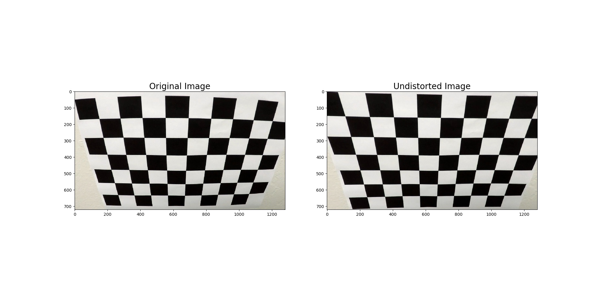
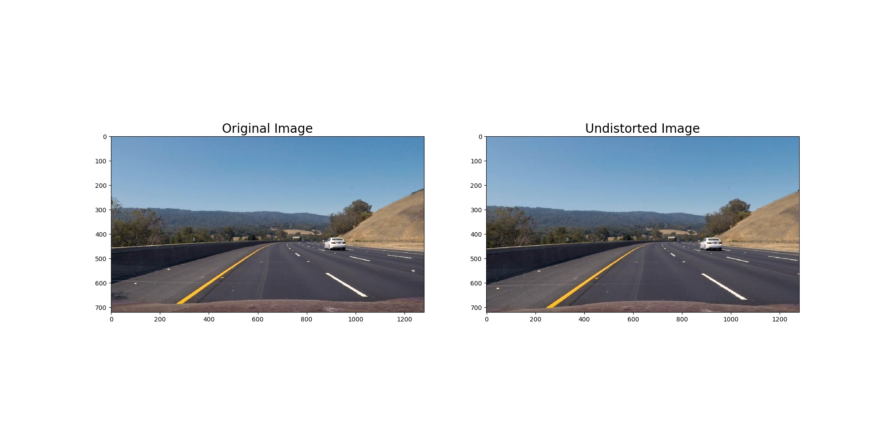
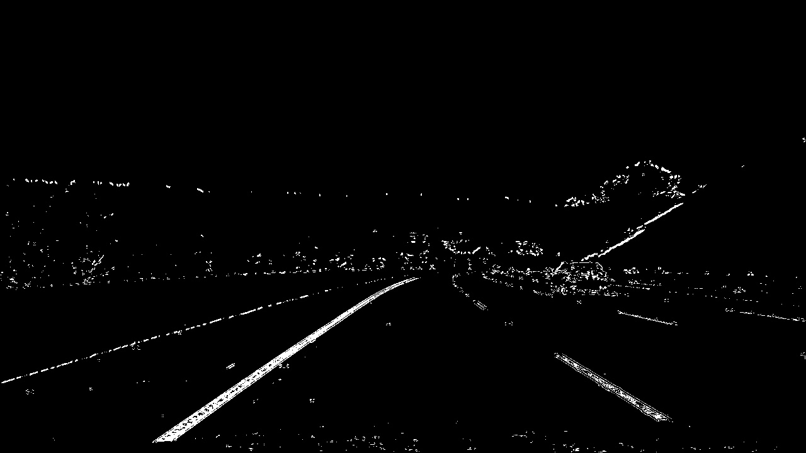
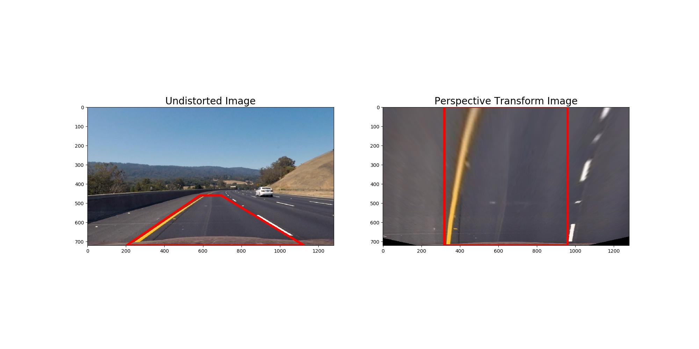
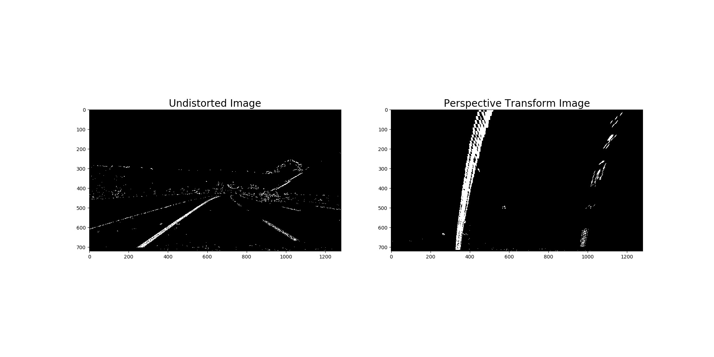
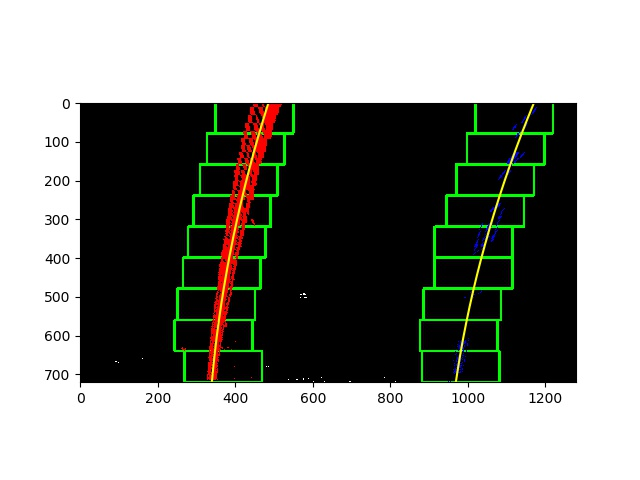
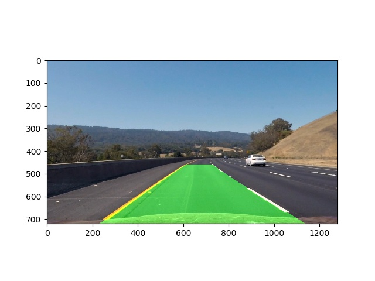

## Writeup Template

### You can use this file as a template for your writeup if you want to submit it as a markdown file, but feel free to use some other method and submit a pdf if you prefer.

---

**Advanced Lane Finding Project**

The goals / steps of this project are the following:

1. Compute the camera calibration matrix and distortion coefficients given a set of chessboard images.
2. Apply a distortion correction to raw images.
3. Use color transforms, gradients, etc., to create a thresholded binary image.
4. Apply a perspective transform to rectify binary image ("birds-eye view").
5. Detect lane pixels and fit to find the lane boundary.
6. Determine the curvature of the lane and vehicle position with respect to center.
7. Warp the detected lane boundaries back onto the original image.
8. Output visual display of the lane boundaries and numerical estimation of lane curvature and vehicle position.


(I checked the [rubric](https://review.udacity.com/#!/rubrics/571/view) points)

---

### Camera Calibration

**Compute the camera calibration matrix and distortion coefficients given a set of chessboard images.**

The code for this step is contained in the lines #10 through #44 of the file called `undistort_img.py`).  

I start by preparing "object points", which will be the (x, y, z) coordinates of the chessboard corners in the world. 
Here I am assuming the chessboard is fixed on the (x, y) plane at z=0, such that the object points are the same for each 
calibration image.  Thus, `objp` is just a replicated array of coordinates, and `objpoints` will be appended with a copy 
of it every time I successfully detect all chessboard corners in a test image.  `imgpoints` will be appended with 
the (x, y) pixel position of each of the corners in the image plane with each successful chessboard detection.  

I then used the output `objpoints` and `imgpoints` to compute the camera calibration and distortion coefficients using 
the `cv2.calibrateCamera()` function. <br>
I applied this distortion correction to the test image using the `cv2.undistort()` 
function and obtained the results: 

- Calibration: Draw chessboard conners

- Calibration undistorted original images


### Pipeline (single images)

#### 1. Example of a distortion-corrected image.


#### 2. I used color transforms, gradients to create a thresholded binary image.
I used a combination of color and gradient thresholds to generate a binary image (thresholding steps at lines #9 through #76
in `gradient.py`).  Here's an example of my output for this step.


- For color: I converted the original RGB images to HLS images, then I applied a threshold *thresh_s_channel* to only 
the *s channel*.
- I applied thresholds to gradient in *x* axis, *y* axis, *magnitute*, and *direction*. <br>
I chose the thresholds as below:
```python
thresh_gradx = (20, 100)
thresh_grady = (20, 100)
thresh_mag = (30, 100)
thresh_dir = (0.7, 1.3)
thresh_s_channel = (170, 255)
```

#### 3. I performed a perspective transform to the birdview.

First, I computed the transformation matrix by using `get_transform_matrix()` function (lines #10 through #14) in the 
file `perspective_transform.py`. The function takes the source (`src`) and destination (`dst`) points as inputs.

The code for my perspective transform includes a function called `warped_birdview()`, which appears in lines #17 through #21 
in the file `perspective_transform.py`.
The `warper()` function takes as inputs an image (`img`) and the transformation matrix (`M`).  

I chose the hardcode the source and destination points in the following manner:

```python
src = np.float32(
    [[(img_size[0] / 2) - 55, img_size[1] / 2 + 100],
    [((img_size[0] / 6) - 10), img_size[1]],
    [(img_size[0] * 5 / 6) + 60, img_size[1]],
    [(img_size[0] / 2 + 55), img_size[1] / 2 + 100]])
dst = np.float32(
    [[(img_size[0] / 4), 0],
    [(img_size[0] / 4), img_size[1]],
    [(img_size[0] * 3 / 4), img_size[1]],
    [(img_size[0] * 3 / 4), 0]])
```

This resulted in the following source and destination points:

| Source        | Destination   | 
|:-------------:|:-------------:| 
| 585, 460      | 320, 0        | 
| 203, 720      | 320, 720      |
| 1127, 720     | 960, 720      |
| 695, 460      | 960, 0        |

I verified that my perspective transform was working as expected by drawing the `src` and `dst` points onto a test image 
and its warped counterpart to verify that the lines appear parallel in the warped image.


An example of a binary warped image:


#### 4. I identified lane-line pixels and fit their positions with a polynomial
This step was done by the function `find_lane_sliding_window()` in `detect_lanelines.py`
##### 4.1. Find the initial point in lanes by detecting the peaks in a histogram
I took a histogram along all the columns in the lower half of the image. 
The peak on the left side and the right side of the histogram are the initial points of the left lane
and the right lane respectively. This step was implemented in function `find_lane_sliding_window()`
from lines #25 to lines #28.

##### 4.2. Sliding window
When I had the initial points on the 2 lanelines, I started search the whole lanelines by using the sliding 
window method.
This step was implemented in function `find_lane_sliding_window()` from lines #30 to lines #102.
There are several parameters in this step:
- nwindows: Number of windows on y axis
- margin: The half width of windows on x axis
- minpix: If the number of detected points in the window > minpix, the initial point of lanelines in the next window
will be updated.

When I obtained two lists of points on the left laneline and the right laneline, I fit a quadratic polynomial to the lists of points 
by using `np.polyfit()` function.

An example of result using the sliding window methods


#### 5. Calculated the radius of curvature of the lanelines and the position of the vehicle with respect to center.
The position of the vehicle with respect to center was calculated in lines #16 through #24 in function 
`calculate_distance_from_lane_center()` in `main.py`

The radius of curvature of the lanelines was computed in lines #48 through #52 in my code in `utils.py`

#### 6. Warped the detected lane boundaries back onto the original image

I implemented this step in lines #59 through #86 in my code in `utils.py` in the function `transform_to_the_road()`.  
Here is an example of my result on a test image:


---

### Pipeline (video)

1. For the first frame, I using the sliding window to find the two lanelines.

2. For the next frames, I considered the conditions: whether both two lanelines detected or not.
If both lanelines are detected, I will search the lanelines based on the previous results on the previous frames.
Otherwise, I used the sliding window to search the lanelines.

I used a buffer to store fit parameters of the lanelines of 20 frames. I computed an average of the buffer to find the 
fit parameters of the two lanelines. 
The code is in `average_fit()` function in `utils.py`, and the lines #145 to #147 in `detect_lanelines.py`

This step was implemented in my code in `main.py` from lines #81 to lines #89.

My final video output is at [https://youtu.be/mpKqJY0iSNM](https://youtu.be/mpKqJY0iSNM)

---

### Discussion

#### 1. Briefly discuss any problems / issues you faced in your implementation of this project.  
- The fine-tuning process to find the proper parameters took me a long time.

#### 2. When does the algorithm fail?
- The algorithm estimated incorrectly the left line in the `project_video.mp4` video from *0:23* to *0:24* seconds. 
The reason for this error is mainly because of a shadow on the road that leads to a blurred yellow line. 

### Future work
- Try to smooth the detected lane lines
- Improve the algorithm to work well on the challenge videos.